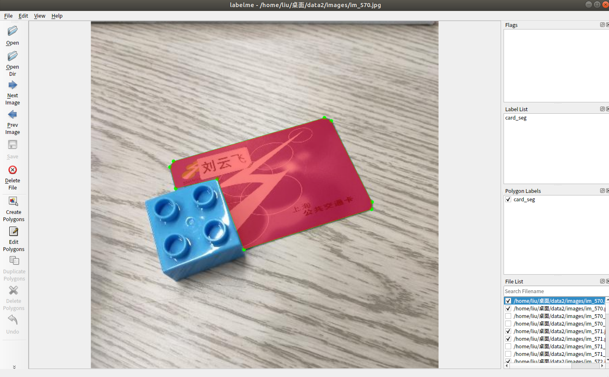
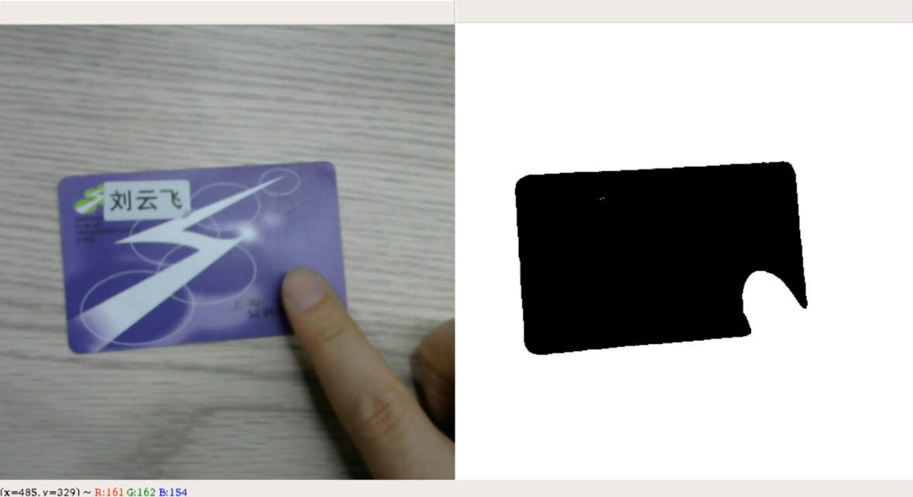

# Segmentation_with_my_dataset
will add more soon!

作者：刘云飞

建议与合作联系邮箱：liuyunfei.1314@163.com

### 0x00 语言和工具

语言：Python 3.7

框架：PyTorch 1.2

标注工具：Labelme

网络结构：U-Net

### 0x01 标注数据

数据标注采用labelme，如下为其标注界面，用点组成多边形。

### 0x02 网络结构及训练

will add soon

### 0x03 结果

可以看到训练后，可以有效的区分前景和背景。

在有遮挡的情况下，可以看到效果依旧很好。

完整的Demo视频可以在B站观看，链接：